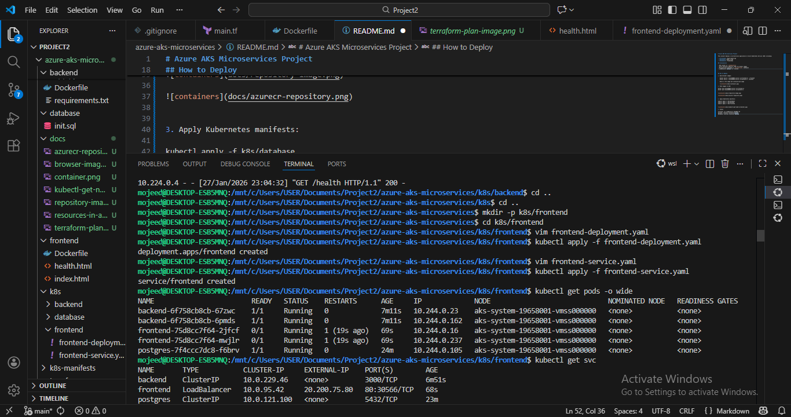
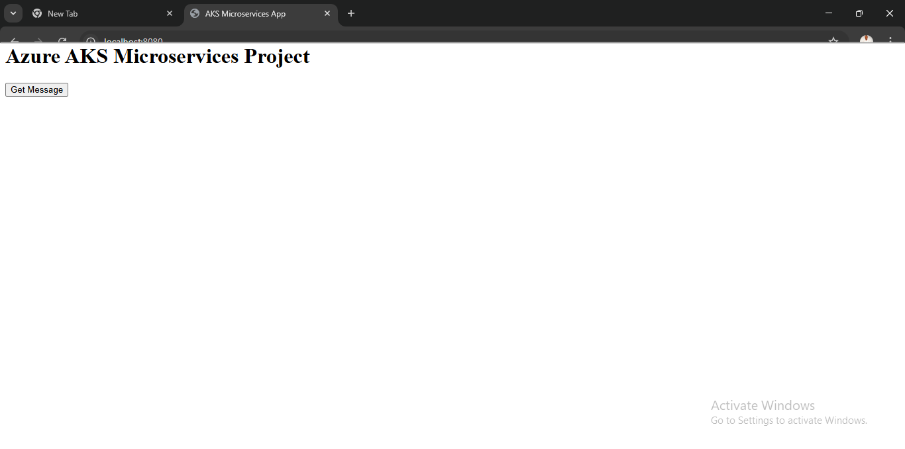

# Azure AKS Microservices Project

This project deploys a microservices application on Azure Kubernetes Service (AKS) including:

- **Frontend**: Nginx-based app
- **Backend**: Node.js API
- **Database**: PostgreSQL


## Repository structure

```
azure-aks-microservices/
├── frontend/
├── backend/
├── database/
├── terraform/
├── k8s-manifests/
├── screenshots/
├── README.md
└── .gitignore


## Architecture

- AKS cluster in `canadacentral`
- Azure Container Registry (ACR) for Docker images
- Microservices deployed in `microservices` namespace
- LoadBalancer service for frontend


## How to Deploy

1. Build Docker images:
   
   docker build -t mojeed0088.azurecr.io/frontend:v1 ./frontend
   docker build -t mojeed0088.azurecr.io/backend:v1 ./backend

   Below is the image and containerized image

   

2. Push images to ACR:

docker push mojeed0088.azurecr.io/frontend:v1
docker push mojeed0088.azurecr.io/backend:v1


3. Apply Kubernetes manifests:

kubectl apply -f k8s/database
kubectl apply -f k8s/backend
kubectl apply -f k8s/frontend


4. Access

Frontend: via LoadBalancer EXTERNAL-IP
Backend: internal ClusterIP service
Database: internal ClusterIP service



5. Accessing on the internet



## Author

## Author

Mojeed Tijani
Azure Cloud Engineer
AZ-104 – Microsoft Azure Administrator
KCNA – Kubernetes and Cloud Native Associate
FinOps Certified Engineer


