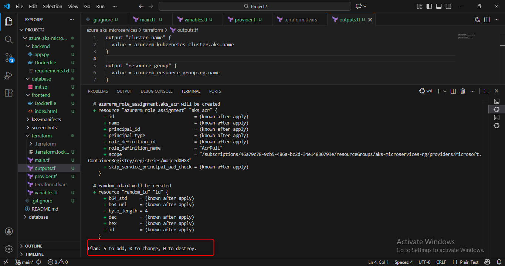
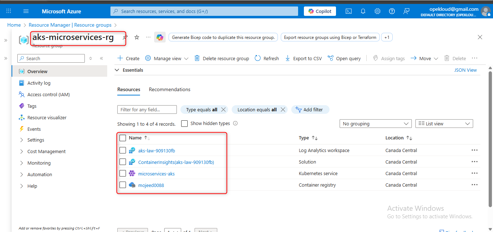
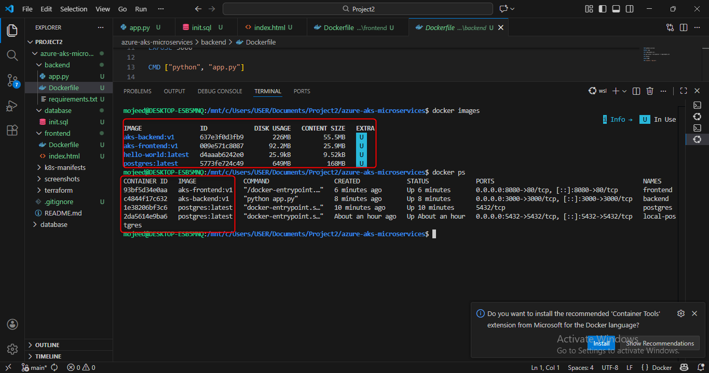
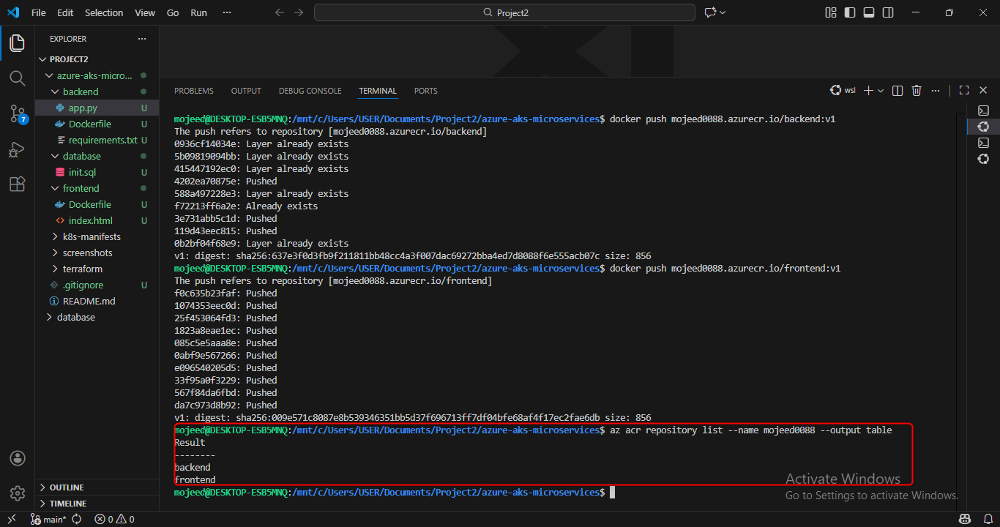
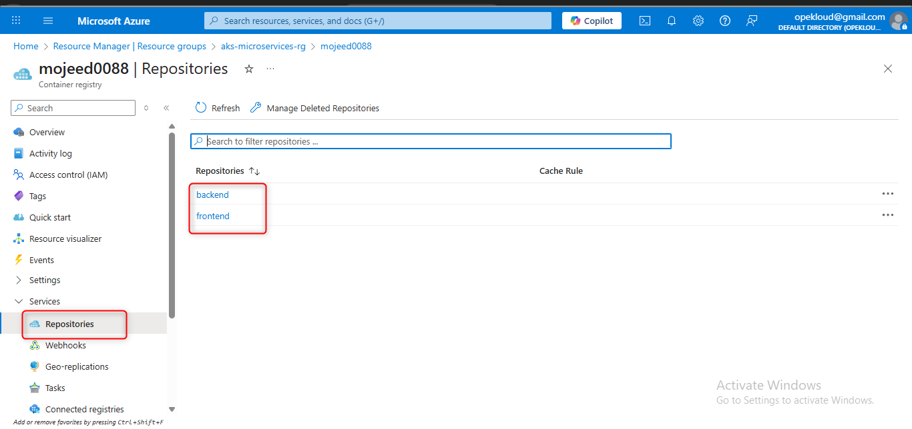
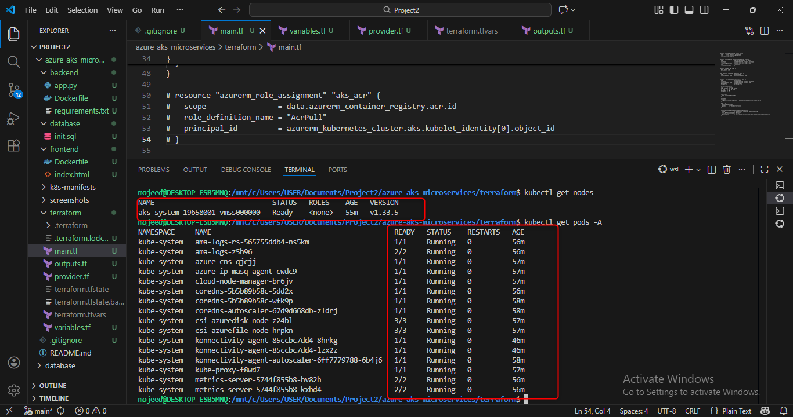
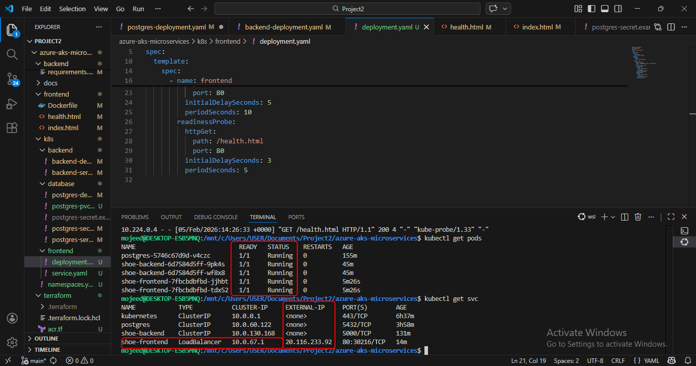
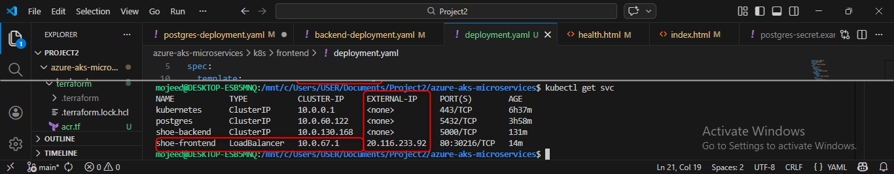
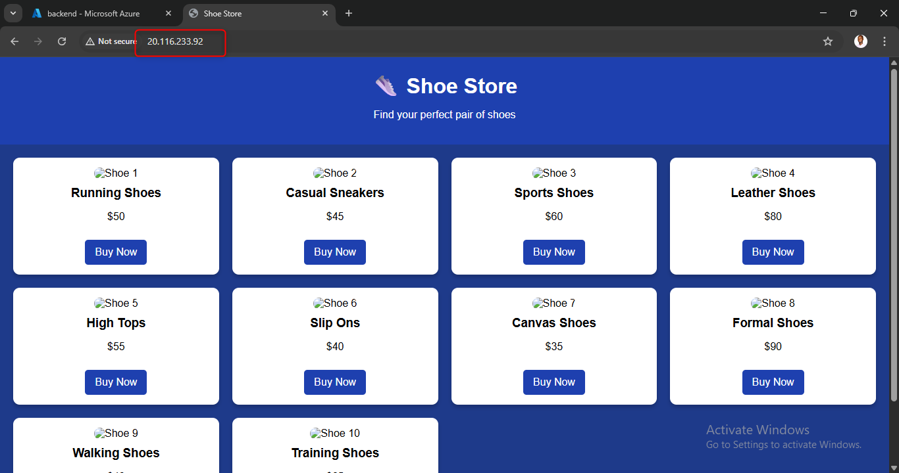

# Azure AKS Microservices Platform

An end-to-end containerized microservices application deployed to **Azure Kubernetes Service (AKS)** using **Docker, Azure Container Registry (ACR), Kubernetes, and Terraform**.

This project demonstrates how I provision Azure infrastructure with Infrastructure as Code, containerize applications, publish images to a private container registry, deploy workloads to Kubernetes, configure service networking, and expose an application through an Azure Load Balancer.

### Architecture

The application consists of three components:

- **Frontend** — HTML/CSS web application
- **Backend** — Python REST API
- **Database** — PostgreSQL

## High-Level Architecture

                         Internet
                            │
                            ▼
                    Azure Load Balancer
                            │
                            ▼
                    ┌───────────────┐
                    │   AKS Cluster │
                    │               │
                    │   namespace   │
                    │               │
                    │ ┌───────────┐ │
                    │ │ Frontend  │ │
                    │ │   Pod     │ │
                    │ └─────┬─────┘ │
                    │       │       │
                    │       ▼       │
                    │ ┌───────────┐ │
                    │ │  Backend  │ │
                    │ │   Pods    │ │
                    │ └─────┬─────┘ │
                    │       │       │
                    │       ▼       │
                    │ ┌───────────┐ │
                    │ │ PostgreSQL│ │
                    │ │   Pods    │ │
                    │ └───────────┘ │
                    └───────────────┘
                            ▲
                            │
                    Azure Container
                       Registry
                            ▲
                            │
                         Docker
                            ▲
                            │
                         Application Code
                            ▲
                            │
                         Azure Infrastructure
                            ▲
                            │
                         Terraform

### Traffic Flow

- The **frontend** is exposed externally through a Kubernetes LoadBalancer service.
- The **backend** uses a ClusterIP service and is accessible internally within the cluster.
- **PostgreSQL** uses a ClusterIP service and is not directly exposed to the internet.
- Docker images are stored in **Azure Container Registry**.
- Azure infrastructure is provisioned using **Terraform**.

---

## Technology Stack

**Area**                           	**Technology**
Cloud Platform                     	Microsoft Azure
Container Orchestration	            Azure Kubernetes Service (AKS)
Containerization	                  Docker
Container Registry	               Azure Container Registry (ACR)
Infrastructure as Code	            Terraform
Frontend                           	HTML / CSS
Backend                           	Python REST API
Database                           	PostgreSQL
Networking	                        Kubernetes Services / Azure Load Balancer

| Area                      | Technology                                |
| ------------------------- | ----------------------------------------- |
| Cloud Platform            | Microsoft Azure                           |
| Container Ochestration    | Azure Kubernetes Service (AKS)            |
| Containerization          | Docker                                    |
| Container Registry        | Azure Container Registry (ACR)            |
| Infrastructure as Code    | Terraform                                 |
| Frontend                  | HTML / CSS                                |              | Backend                   | Python REST API                           |
| Database                  | PostgreSQL                                |
| Networking                | Kubernetes Services / Azure Load Balancer |

---

## Engineering Decisions

### Terraform for Infrastructure as Code

Azure infrastructure is provisioned using Terraform rather than manually creating resources through the Azure Portal. This makes the infrastructure repeatable and version-controlled, and easier to reproduce.

### Azure Container Registry

Application container images are stored in Azure Container Registry so they can be retrieved by the AKS workloads.

### Kubernetes Service Types

The frontend uses a LoadBalancer service to provide external access.

The backend and PostgreSQL services use ClusterIP so they remain internal to the Kubernetes cluster.

### Dedicated Kubernetes Namespace

Application resources are deployed into a dedicated namespace to provide logical separation and simplify resource management.

### Persistent Storage

PostgreSQL uses a PersistentVolumeClaim to provide persistent storage for the database workload.

---

## Project Structure

    azure-aks-microservices/ 
    |
    ├── backend/
    │   ├── Dockerfile
    │   ├── app.py
    │   └── requirements.txt
    |
    ├── frontend/
    │   ├── Dockerfile
    │   ├── health.html
    │   └── index.html
    |
    ├── k8s/
    │   ├── backend/
    │   │   ├── backend-deployment.yaml
    │   │   └── backend-service.yaml
    │   |
    |   ├── database/
    │   │   ├── postgres-deployment.yaml
    │   │   ├── postgres-pvc.yaml
    │   │   ├── postgres-secret.example.yaml
    │   │   └── postgres-service.yaml
    │   |
    |   ├── frontend/
    │   │   ├── deployment.yaml
    │   │   └── service.yaml
    │   |
    |   └── namespaces.yaml
    |
    ├── terraform/
    |   ├── acr.tf
    |   ├── main.tf
    |   ├── outputs.tf
    |   ├── provider.tf
    |   └── variables.tf
    |    
    ├── docs/
    │   ├── azurecr-repository.png
    │   ├── docker-images.png
    │   ├── frontendapp-running-aks.png
    │   ├── service-ips.png
    │   ├── kubectl-get-node-screenshot.png
    │   ├── pods-running-screenshot.png
    │   ├── repository-image.png
    │   ├── resources-in-azure.png
    │   └── terraform-plan-image.png
    |
    ├── .gitignore
    └── README.md

## Prerequisites

Before deploying this project, I ensured the following tools are installed and configured:

- Azure CLI
- Terraform
- Docker
- kubectl
- An active Azure subscription

I also ensured that I had permission to create the required Azure resources.

### 1. Provision Azure Infrastructure

Navigate to the Terraform directory:

cd terraform

Initialize Terraform:

terraform init

Validate the configuration:

terraform validate

Review the planned infrastructure:

terraform plan

Apply the configuration:

terraform apply

### Terraform Plan

### Azure Resources   

### 2. Build Docker Images

From the project root:

docker build -t mojeed0088.azurecr.io/frontend:v1 ./frontend

docker build -t mojeed0088.azurecr.io/backend:v1 ./backend

### Docker Images

The application images are built locally before being pushed to Azure Container Registry.

   

### 3. Push Images to Azure Container Registry

Authenticate with Azure Container Registry and push the images:

docker push mojeed0088.azurecr.io/frontend:v1
  
docker push mojeed0088.azurecr.io/backend:v1

### Images in ACR

### 4. Connect to AKS

Retrieve AKS credentials:

az aks get-credentials --resource-group aks-microservices-rg --name microservices-aks

Verify cluster connectivity:

kubectl get nodes

### AKS Nodes

## 5. Deploy the Application

Create the required namespace:

kubectl apply -f k8s/namespaces.yaml

Deploy the database:

kubectl apply -f k8s/database/

Deploy the backend:

kubectl apply -f k8s/backend/

Deploy the frontend:

kubectl apply -f k8s/frontend/

### 6. Verify the Deployment

Check the Pods:

kubectl get pods

Check the Services:

kubectl get services

Check the Deployments:

kubectl get deployments

### Running Pods

### 7. Service Access

The application uses the following Kubernetes service model:

| Component       | Service Type  | Accessibility   |
| --------------- | ------------- | --------------- |
| Frontend        | LoadBalancer  | External        |
| Backend	        | ClusterIP     | Internal        |
| PostgreSQL      | ClusterIP     | Internal        |

Check the assigned service addresses:

kubectl get services

### Service IPs

### 8. Access the Application

After the frontend LoadBalancer receives an external IP, open the IP address in a browser.

### Application Running on AKS

---

## Troubleshooting

### Check AKS Nodes

kubectl get nodes

### Check Pod Status

kubectl get pods

### Inspect a Pod

kubectl describe pod <pod-name>

### View Container Logs

kubectl logs <pod-name>

### Check Services

kubectl get services

## Common Kubernetes Issues

### ImagePullBackOff

Possible causes:

- Incorrect image name or tag
- Image does not exist in ACR
- AKS cannot

Check:

kubectl describe pod <pod-name>

### CrashLoopBackOff

Check application logs:

kubectl logs <pod-name>

Then inspect the Pod events:

kubectl describe pod <pod-name>

### Pod Pending

Check:

kubectl describe pod <pod-name>

Possible causes include insufficient node resources, scheduling constraints, or storage/PVC issues.

### Frontend Has No External IP

Check:

kubectl get service

and inspect the frontend service:

kubectl describe service <frontend-service-name>

---

## Production Considerations

This project is a portfolio/reference implementation focused on demonstrating AKS, Docker, Kubernetes, Terraform, and cloud networking.

For a production environment, I would further consider:

- Azure Key Vault for secret management
- Microsoft Entra Workload ID
- Azure Monitor and Container Insights
- Kubernetes resource requests and limits
- Horizontal Pod Autoscaling
- Kubernetes Network Policies
- Ingress and TLS/HTTPS
- Private AKS networking
- Container image vulnerability scanning
- Separate development, staging, and production environments
- Centralized logging and alerting
- Automated CI/CD deployments
  
## Key Skills Demonstrated

- Azure Kubernetes Service (AKS)
- Azure Container Registry (ACR)
- Docker and containerization
- Kubernetes Deployments
- Kubernetes Services
- Kubernetes Namespaces
- Kubernetes persistent storage
- Terraform Infrastructure as Code
- Azure cloud infrastructure
- Container image management
- Kubernetes troubleshooting
- Cloud networking
- Load balancing
- Microservices deployment

## What I Learned

This project strengthened my practical understanding of:

- Provisioning Azure infrastructure with Terraform
- Building and publishing Docker images
- Deploying containerized workloads to AKS
- Configuring Kubernetes Services
- Managing internal and external application traffic
- Working with Kubernetes storage
- Troubleshooting container and Pod failures
- Structuring a cloud-based microservices deployment

## Author

### Mojeed Tijani

Cloud Engineer (Azure)

### Certifications

- AZ-104 — Microsoft Azure Administrator
- KCNA — Kubernetes and Cloud Native Associate
- FinOps Certified Engineer
